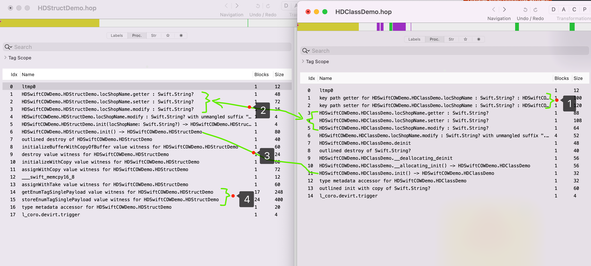

## Swift之struct二进制大小分析

>随着Swift的日渐成熟和给开发过程带来的便利性及安全性，京喜App中的原生业务模块和基础模块使用Swift开发占比逐渐增高。本次讨论的是struct对比Class的一些优劣势，重点分析对包体积带来的影响及规避措施。

### 一、基础知识

#### 1、类型对比


**引用类型：**将一个对象赋值给另一个对象时，系统不会对此对象进行拷贝，而会将指向这个对象的指针赋值给另一个对象，当修改其中一个对象的值时，另一个对象的值会随之改变。【Class】

**值类型：**将一个对象赋值给另一个对象时，会对此对象进行拷贝，复制出一份副本给另一个对象，在修改其中一个对象的值时，不影响另外一个对象。【structs、Tuples、enums】。Swift中的【Array, String, and Dictionary】

两者的区别可以查阅 [Apple官方文档](https://developer.apple.com/swift/blog/?id=10) 


#### 2、Swift中struct和Class区别

```swift
1、class是引用类型、struct是值类型
2、类允许被继承，结构体不允许被继承
3、类中的每一个成员变量都必须被初始化，否则编译器会报错，而结构体不需要，编译器会自动帮我们生成init函数，给变量赋一个默认值
4、当你需要继承Objective-C某些类的的时候使用class
5、class声明的方法修改属性不需要`mutating`关键字；struct需要
6、如果需要保证数据的唯一性，或者保证在多线程数据安全，可以使用struct；而希望创建共享的、可变的状态使用class
```

以上三点可以参考 [深入理解Swift中的Class和Struct](https://juejin.cn/post/6844903775816155144) 进行更多细节的阅读学习


### 二、struct优选

> 孔子曰：择其善者而从之，其不善者而改之。

##### 1、安全性

```
使用struct是值类型，在传递值的时候它会进行值的copy，所以在多线程是安全的。无论你从哪个线程去访问你的 Struct ，都非常简单。
```

##### 2、效率性

```
struct存储在stack中(这比malloc/free调用的性能要高得多)，class存储在heap中，struct更快。
```

##### 3、内存泄露

```
没有引用计数器，所以不会因为循环引用导致内存泄漏
```

基于这些因素，在日常开发中，我们能用 `struct` 的我们尽量使用 `struct` 。


### 三、struct的不完美

> 孟子曰：鱼，我所欲也，熊掌亦我所欲也；二者不可得兼。

“熊掌” 再好，吃多了也难以消化。特别在中大型项目中，如果没有节制的使用`struct`，可能会带来意想不到的问题。

#### 1、内存问题

**值类型** 有哪些问题？比如在两个 `struct` 赋值操作时，可能会发现如下问题：

```
1、内存中可能存在两个巨大的数组；
2、两个数组数据是一样的；
3、重复的复制。
```


**解决方案：COW(copy-on-write) 机制** 

```swift
1、Copy-on-Write 是一种用来优化占用内存大的值类型的拷贝操作的机制。
2、对于Int，Double，String 等基本类型的值类型，它们在赋值的时候就会发生拷贝。（内存增加）
3、对于 Array、Dictionary、Set 类型，当它们赋值的时候不会发生拷贝，只有在修改的之后才会发生拷贝。（内存按需延时增加）
4、对于自定义的数据类型不会自动实现COW，可按需实现。
```

那么自定义的数据如何实现COW呢，可以参考官方代码：

```swift
/*
我们使用class，这是一个引用类型，因为当我们将引用类型分配给另一个时，两个变量将共享同一个实例，而不是像值类型一样复制它。
*/
final class Ref<T> {
  var val : T
  init(_ v : T) {val = v}
}

/*
创建一个struct包装Ref：
由于struct是一个值类型，当我们将它分配给另一个变量时，它的值被复制，而属性ref的实例仍由两个副本共享，因为它是一个引用类型。
然后，我们第一次更改两个Box变量的值时，我们创建了一个新的ref实例，这要归功于：isUniquelyReferencedNonObjC
这样，两个Box变量不再共享相同的ref实例。
*/
struct Box<T> {
    var ref : Ref<T>
    init(_ x : T) { ref = Ref(x) }

    var value: T {
        get { return ref.val }
        set {
          //  isKnownUniquelyReferenced 函数来检查某个引 用只有一个持有者
          // 如果你将一个 Swift 类的实例传递给这个函数，并且没有其他变量强引用 这个对象的话，函数将返回 true。如果还有其他的强引用，则返回 false。不过，对于 Objective-C 的类，它会直接返回 false。
          if (!isUniquelyReferencedNonObjC(&ref)) {
            ref = Ref(newValue)
            return
          }
          ref.val = newValue
        }
    }
}
// This code was an example taken from the swift repo doc file OptimizationTips 
// Link: https://github.com/apple/swift/blob/master/docs/OptimizationTips.rst#advice-use-copy-on-write-semantics-for-large-values
```

实例说明：我们想在一个使用`struct`类型的User中使用copy-on-write的：

```swift
struct User {
    var identifier = 1
}

let user = User()
let box = Box(value: user)
var box2 = box                  // box2 shares instance of box.ref.value

box2.value.identifier = 2 			// 在改变的时候拷贝 box2.value=2	box.value=1


//打印内存地址
func address(of object: UnsafeRawPointer) {
    let addr = Int(bitPattern: object)
    print(NSString(format: "%p", addr))
}
```

注意这个机制**减少的是内存的增加**，以上可以参考 [写更好的 Swift 代码：COW(Copy-On-Write)](https://juejin.cn/post/7006123728635428871)  进行更多细节的阅读学习。


#### 2、二进制体积问题

这是一个意向不到的点。发现这个问题的契机是 `何骁` 同学在对京喜项目进行瘦身的时候发现，在梳理项目中各个模块的大小发现商详模块的包体积会比其他模块要大很多。排除该模块业务代码多之外，通过对 `linkmap` 文件计算发现，有两个 `struct` 模型体积大的异常明显：

| struct类型库名  | **二进制大小** |
| :-------------: | :------------: |
| PGDomainModel.o |     507 KB     |

通过简单的将两个对象，改成 `class` 类型后的二进制大小为：

|  class类型库名  | **二进制大小** |
| :-------------: | :------------: |
| PGDomainModel.o |     256 KB     |

这两个对象会存在在不同类中进行传递，根据`值类型` 的特性，增加也只是内存的大小，而不是二进制的大小。那么问题就来了：

##### 2.1、大小对比

回答该问题之前，先通过查阅资料发现，在 `C语言` 中 `static stuct`占用的二进制体积的确会大些，主要是因为`static stuct`是 `zero-initialized or uninitialized` , 也就是说它在初始化不是空的。它们会进入数据段，也就是说，即使在初始化 `struct` 的一个字段，二进制文件也包含了整个结构的完整 `image` 。 `Swift` 可能也类似。具体可以查询： [Why does usage of structs increase application's binary size?](https://stackoverflow.com/questions/52372423/why-does-usage-of-structs-increase-applications-binary-size)

通过代码实践：

```swift
class HDClassDemo {
    var locShopName: String?
}
struct HDStructDemo {
    var locShopName: String?
}
```

编译后计算 `linkmap` 的体积分别为：

```swift
1.54K HDClassDemo.o
1.48K HDStructDemo.o
```

并没有得出 `struct` 会比 `class` 大的表现，通过 `Hopper Disassembler` 查看 `.o` 文件对比：

 

发现有四处值得注意的点：

```swift
1、class特有的KVO特性，想对比 struct 会有体积的增加；
2、同样的 getter/setter/modify 方法，class增加的体积也多一些，猜测有可能是class类型会有更多的逻辑判断；
3、init 方法中，struct增加体积较多，应该是 struct 初始化的时候，给变量赋一个默认值的原因；
4、struct 中的 "getEnumTagSinglePayload value" 和 "storeEnumTagSinglePayload value" 占用较大的，但是通过linkmap计算，这两部分应该没有被最终在包体积中。

通过阅读 https://juejin.cn/post/7094944164852269069 这两个字段是为 Any 类型服务，上面的例子不涉及
struct ValueWitnessTable {
    var initializeBufferWithCopyOfBuffer: UnsafeRawPointer
    var destroy: UnsafeRawPointer
    var initializeWithCopy: UnsafeRawPointer
    var assignWithCopy: UnsafeRawPointer
    var initializeWithTake: UnsafeRawPointer
    var assignWithTake: UnsafeRawPointer
    var getEnumTagSinglePayload: UnsafeRawPointer
    var storeEnumTagSinglePayload: UnsafeRawPointer
    var size: Int
    var stride: Int
    var flags: UInt32
    var extraInhabitantCount: UInt32
}
```

**所以结论是上面的写法，`struct` 并没有表现比 `class` 体积大。可能是 Apple 在后面已经优化解决掉了。**

**但是**，测试验证过程中发现另外一个奇特的地方，当使用 `let` 修饰变量时

```swift
class HDClassDemo {
    let locShopName: String? = nil
}
struct HDStructDemo {
    let locShopName: String?
}
```

编译后计算 `linkmap` 的体积分别为：

```
1.25K	HDStructDemo.o
0.94K	HDClassDemo.o
```

通过 `Hopper Disassembler` 查看 `.o` 文件对比：


在这种情况下，有两个结论

**1、`let` 比 `var` 的二进制大小会小，减少部分主要是在 `setter/modify` 和 `kvo` 字段中。所以开发过程中养成好习惯，非必要不使用 `var` 修饰**

**2、在一个或者多个 `let` 修饰的情况下，`struct` 二进制大小的确是大于 `class`**


最后，如果 `struct`  对象通过赋值操作传递给其他类（`OtherObject`），比如这样（项目中经常存在）

```swift
let sd = HDStructDemo()
OtherObject().sdAction(sd: sd)

class OtherObject: NSObject {
    private var sd: HDStructDemo?
    func sdAction(sd: HDStructDemo) {
        self.sd = sd
        print(sd)
    }
}
```

在其他类(`OtherObject`)中的二进制中有多个内存地址的存储和读取端，一个变量会有两次`ldur`、`str` 操作，猜测分别对 变量名称和类型的两次操作：

```
00000000000003c0         ldur       x4, [x29, var_F0]
00000000000003c4         str        x4, [sp, #0x230 + var_228]
00000000000003c8         ldur       x3, [x29, var_E8]
00000000000003cc         str        x3, [sp, #0x230 + var_220]
00000000000003d0         ldur       x2, [x29, var_E0]
00000000000003d4         str        x2, [sp, #0x230 + var_218]
00000000000003d8         ldur       x1, [x29, var_D8]
00000000000003dc         str        x1, [sp, #0x230 + var_210]
00000000000003e0         ldur       x17, [x29, var_D0]
00000000000003e4         str        x17, [sp, #0x230 + var_208]
00000000000003e8         ldur       x16, [x29, var_C8]
00000000000003ec         str        x16, [sp, #0x230 + var_200]
00000000000003f0         ldur       x15, [x29, var_C0]
00000000000003f4         str        x15, [sp, #0x230 + var_1F8]
00000000000003f8         ldur       x14, [x29, var_B8]
00000000000003fc         str        x14, [sp, #0x230 + var_1F0]
0000000000000400         ldur       x13, [x29, var_B0]
0000000000000404         str        x13, [sp, #0x230 + var_1E8]
0000000000000408         ldur       x12, [x29, var_A8]
000000000000040c         str        x12, [sp, #0x230 + var_1E0]
0000000000000410         ldur       x11, [x29, var_A0]
0000000000000414         str        x11, [sp, #0x230 + var_1D8]
0000000000000418         ldur       x10, [x29, var_98]
000000000000041c         str        x10, [sp, #0x230 + var_1D0]
0000000000000420         ldur       x9, [x29, var_90]
0000000000000424         str        x9, [sp, #0x230 + var_1C8]
0000000000000428         ldur       x8, [x29, var_88]
000000000000042c         str        x8, [sp, #0x230 + var_1C0]
```

**这将势必对整个App的包体积带来巨大的增量。一定一定一定要结合项目进行合理的选择。**


##### 2.2、如何取舍

在安全、效率、内存、二进制大小多个方面，如何取得平衡是关键。

**单从二进制大小作为考量**，这里有一些经验总结可以提供参考：

**1、如果变量都是let修饰，class 远胜于 struct，变量越多，优势越大；7个变量的情况下大小分别为：**

```swift
3.12K	HDStructDemo.o
1.92K	HDClassDemo.o
```

**2、如果变量都是var修饰，struct 远胜于 class，变量越多，优势越大：**

```
1个变量：
1.54K	HDClassDemo.o
1.48K	HDStructDemo.o

60个变量：
44.21K	HDClassDemo.o
24.22K	HDStructDemo.o

100个变量：
71.74K	HDClassDemo.o
38.98K	HDStructDemo.o
```

**3、如果变量都是var修饰，但是都遵循 Decodable 协议，这里又有乾坤：**

这种情况有可能在项目中存在，并且规律不是简单的谁大谁小，而是根据变量的不同，呈现不同的规则：

使用脚本快速创建分别包含1-200个变量的200个文件

```sh
fileCount=200
for (( i = 0; i < $fileCount; i++ )); do
	className="HDClassObj_${i}"
	classFile="${className}.swift"
	structName="HDStructObj_${i}"
	structFile="${structName}.swift"
	classDecodableName="HDClassDecodableObj_${i}"
	classDecodableFile="${classDecodableName}.swift"
	structDecodableName="HDStructDecodableObj_${i}"
	structDecodableFile="${structDecodableName}.swift"
	echo "class ${className} {" > $classFile
	echo "struct ${structName} {" > $structFile
	echo "class ${classDecodableName}: Decodable {" > $classDecodableFile
	echo "struct ${structDecodableName}: Decodable {" > $structDecodableFile
	for (( j = 0; j < $i; j++ )); do
		line="\tvar name_${j}: String?"
		echo $line >> $classFile
		echo $line >> $structFile
		echo $line >> $classDecodableFile
		echo $line >> $structDecodableFile
	done
	echo "}" >> $classFile
	echo "}" >> $structFile
	echo "}" >> $classDecodableFile
	echo "}" >> $structDecodableFile
done
```

得到200个文件后，选择 `arm64` 架构编译后，分析 `linkmap` 文件，得到的文件大小为：

```swift
index	Class	Struct	ClassDecodable	StructDecodable
1	0.7	0.15	3.03	2.32
2	1.53	1.48	6.54	6.37
3	2.23	1.88	8.12	7.66
4	2.94	2.31	9.37	8.65
5	3.64	2.69	10.73	9.69
6	4.34	3.08	12.05	10.66
7	5.04	3.46	13.36	11.63
8	5.74	3.84	14.62	12.62
9	6.45	4.22	14.97	13.61
10	7.15	4.62	16.11	14.9
11	7.85	5.02	17.25	15.96
12	8.55	5.42	18.39	17.06
13	9.26	5.82	19.53	18.2
14	9.96	6.22	20.67	19.36
...
...
...
76	53.61	31.09	92.19	91.91
77	54.31	31.49	93.34	93.35
...
...
...
198	139.69	79.99	234.45	329.59
199	140.4	80.39	235.58	332
200	141.11	80.79	236.72	334.43
```

对于的增加曲线图为：


**HDStructDecodableObj在77个变量下体积将返超HDClassDecodableObj**

根据曲线规则，可以得出 **Class、Struct、ClassDecodable** 增长是线性函数，对应的分别函数近似为：

```
Y = 0.825 + X * 0.705
Y = 1.0794 + X * 0.4006
Y = 5.3775 + X * 1.1625
```

**HDClassDecodableObj** 的函数规则分布猜测可能是 `一元二次函数（抛物线）` 、`对数函数` 。在真实对比测试数据均不符合，也可能是 `分段函数` 吧。有知晓的同学请告知。


### 四、预防策略

> 圣人云：不治已病治未病，不治已乱而治未乱。

`京喜` 从2020年开始陆续使用 `Swift` 作为业务开发的主要开发语言，特别是在 `商详、直播、购物车、结算、设置` 等业务已经全量化。单单将 `商详` 中的 `PGDomainModel` 、`PGDomainData` 从 `struct` 改成 `class` 类型，该模块的二进制大小从 `12.1M` 左右减少到 `5.5M`  ，这主要是因为这两个对象本身的变量较多，并且被大量其他楼层类赋值使用导致，收益可谓是具大。其他模块收益相对会少一些。

|      **模块名**       | **v5.33.6二进制大小** | **v5.36.0二进制大小** | **二进制增量** |
| :-------------------: | :-------------------: | :-------------------: | :------------: |
| pgProductDetailModule |        12.1 MB        |        5.5 MB         |    - 6.6 MB    |

可以通过 `SwiftLint` 的自定义规则，当在 `HDClassDecodableObj` 情况下，超过一定数量变量时，编译错误来规避类似的问题。

自定义规则如下：

```yml
custom_rules:
  disable_more_struct_variable:
    included: ".*.swift"
    name: "struct不应包含超过10个的变量"
    regex: "^(struct).*(Decodable).*(((\n)*\\s(var).*){10,})"
    message: "struct不应包含超过10个的变量"
    severity: error
```

编译报错的效果如下：


规则也暂时发现的两个问题：

#### 1、regex次数问题

理论上的数量应该是 `77` 个才告警，但是配置数量超过 `15` 在编译过程就会非常慢，在正则在 [正则可视化页面](https://wangwl.net/static/projects/visualRegex#) 运行稳定，但是使用 `SwiftLint` 却几乎卡死，问题暂未找到解决方案。可能需要阅读  `SwiftLint`  源码求助。

#### 2、识别率问题

因为是根据 `var` 的次数进行匹配，一旦出现注释（`//`） 统计也会误差。正则过于复杂，暂时也没有找到解决方案。


本文涉及到的代码、脚本、工具、数据都开源存放在 [HDSwiftStructSizeDemo](https://github.com/erduoniba/HDSwiftStructSizeDemo) ，文件结构说明如下：

```shell
.
├── Asserts # 图片资源
├── README.md
└── Struct对比
    ├── HDSwiftCOWDemo # 测试struct和class大小的工程（代码）
    │   ├── HDSwiftCOWDemo	
    │   └── HDSwiftCOWDemo.xcodeproj
    ├── LinkMap # 改造后的LinkMap源码，支持二进制升/降排序序（工具）
    │   ├── LinkMap
    │   ├── LinkMap.xcodeproj
    │   ├── README.md
    │   ├── ScreenShot1.png
    │   └── ScreenShot2.png
    ├── StructSize.playground # playground工程，主要验证二进制增长的函数（代码）
    │   ├── Contents.swift
    │   ├── contents.xcplayground
    │   └── playground.xcworkspace
    ├── Swift-Struct/Class大小.xlsx # struct和class大小数据及图表生成（数据：最终产物）
    └── linkmap对比 # 记录struct和class的linkmap数据（数据）
        ├── HDClassDecodableObj.txt
        ├── HDClassObj.txt
        ├── HDStructDecodableObj.txt
        ├── HDStructObj.txt
        └── LinkMap.app
```

欢迎大家 🌟Star 🌟

### 五、参考资料

[深入理解Swift中的Class和Struct](https://juejin.cn/post/6844903775816155144) 

[写更好的 Swift 代码：COW(Copy-On-Write)](https://juejin.cn/post/7006123728635428871)  

[Swift官方COW文档](https://github.com/apple/swift/blob/main/docs/OptimizationTips.rst#id29)

[Understanding Swift Copy-on-Write mechanisms](https://medium.com/@lucianoalmeida1/understanding-swift-copy-on-write-mechanisms-52ac31d68f2f)

[swift 结构体copy-on-write技术](https://www.jianshu.com/p/052e6601d3a3)

[什么是COW？](https://www.youtube.com/watch?v=rhQqYqwGef4)

[数据来测试是否实现COW](https://jaredkhan.com/blog/swift-copy-on-write)

[COW自定义实现](https://www.youtube.com/watch?v=MnemjnAGse4)

[arm汇编储存指令str stur和读取指令 ldr ldur的使用,对应xcode c++中的代码反汇编教程](https://blog.csdn.net/boildoctor/article/details/118515327) 

[正则可视化页面](https://wangwl.net/static/projects/visualRegex#)

[正则表达式全集](https://tool.oschina.net/uploads/apidocs/jquery/regexp.html)

[SwiftLint](https://github.com/realm/SwiftLint)

[SwiftLint_Rule](https://realm.github.io/SwiftLint/rule-directory.html)

[SwiftLint-Advanced](https://rakeshchander.medium.com/swiftlint-advanced-afaa2752f0d)